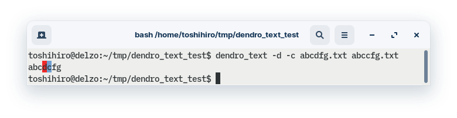

[](https://github.com/tos-kamiya/dendro_text/actions/workflows/tests.yaml)

dendro_text
===========

Draw a dendrogram of similarity between text files.

The similarity is measured in terms of **Damerau-Levenshtein edit distance**.
The distance between given two texts is a count of inserted, deleted, and substituted characters required to modify one text to the other.
A smaller value means that the two texts are more similar.

Features:

* **Parallel execution**: Supports execution on multiple CPU cores. Plus, jit compilation by Numba (v1.6+).

* **Options in tokenization**: By default, the text is compared with a sequence of words extracted by splitting input text into different character types. Optionally, you can compare texts line by line, character by character, or token by token as extracted with lexical analyzers of programming languages.

* **File-centric search**: A function to list files in order of similarity to a given file.

* **Diff (Experimental)**: Diff functionality to show textual differences between files. (This function is provided to check for differences in similarity calculations depending on tokenization.)

## Installation

```sh
pip install dendro-text
```

If you run the dendro_text and get the following error message, please install dendro-text with docopt-ng.

```sh
$ dendro_text
Error: the Docopt module has not been installed. Install it with `pip install docopt-ng`.
```

```sh
pip install dendro-text[docopt-ng]
```

(To make `dendro-text` compatible with both `docopt` and `docopt-ng`, dependencies on them are now explicitly extra dependencies.)

To uninstall,

```sh
pip uninstall dendro-text
```

### Numba (option)

**To enable jit compilation by Numba, install it according to the instructions on [Numba website](https://numba.pydata.org/).**

Note that the installation of Numba differs for each platform. For example, on Ubuntu 20.04, in addition to installing numba with pip, the following is required:

```sh
sudo apt install python3-testresources
```

Numba is used transparently. When you run `dendro_text`, if it detects that Numba is installed on your system, `dendro_text` will call functions compiled in jit, otherwise it will call pure Python functions.

The speedup with Numba was approx. 5x in one example I tried.

## Usage

```sh
dendro_text <file>...
```

### Options

#### Tokenization/preprocessing

```sh
  -t --tokenize             Compare texts as tokens of languages indicated by file extensions, using Pygments lexer.
  -c --char-by-char         Compare texts in a char-by-char manner.
  -l --line-by-line         Compare texts in a line-by-line manner.
  -U --no-uniq-files        Do not remove duplicates from the input files.
  --prep=PREPROCESSOR       Perform preprocessing for each input file.
```

#### Dendrogram format

```sh
  -m --max-depth=DEPTH      Flatten the subtrees (of dendrogram) deeper than this.
  -a --ascii-char-tree      Draw a tree picture with ASCII characters, not box-drawing characters.
  -B --box-drawing-tree-with-fullwidth-space    Draw a tree picture with box-drawing characters and fullwidth space.
  -s --file-separator=S     File separator (default: comma).
  -f --field-separator=S    Separator of tree picture and file (default: tab).
```

Option `-a` is for environments (such as C locale) where box-drawing characters turns into garbled characters.
Option `-B` is to prevent tree pictures from being corrupted in environments where box-drawing characters are treated as fullwidth ones.

#### Parallel execution

```sh
  -j NUM                    Parallel execution. Number of worker processes.
  --progress                Show progress bar with ETA.
```

#### File-centric search mode

```sh
  -n --neighbors=NUM        Pick up NUM (>=1) neighbors of (files similar to) the first file. Drop the other files.
  -N --neighbor-list=NUM    List NUM neighbors of the first file, in order of increasing distance. `0` for +inf.
```

#### Pyplot ouutput mode

```sh
  -p --pyplot               Plot dendrogram with `matplotlib.pyplot`
  --pyplot-font-names       List font names can be used in plotting dendrogram.
  --pyplot-font=FONTNAME    Specify font name in plotting dendrogram.
```

#### Diff mode

```sh
  -d --diff                 Diff mode (Implies option -U). **Experimental.**
```

#### Show-words mode

```sh
  -W --show-words           Show list of words extracted from the input file.
```

### Walk-through

1. Prepare several text files whose file names are the contents as they are.

```sh
$ bash

$ for t in ab{c,cc,ccc,cd,de}fg; do echo $t > $t.txt; done

$ ls -1
abcccfg.txt
abccfg.txt
abcdfg.txt
abcfg.txt
abdefg.txt
```

Here, the content of each file is the same as its filename, e.g.:

```sh
$ cat abccfg.txt
abccfg
```

2. Create dendrograms showing file similarity by character-by-character comparison.

```sh
$ dendro_text -c *.txt
─┬─┬─┬──    abcfg.txt
 │ │ └──    abcdfg.txt
 │ └─┬──    abccfg.txt
 │   └──    abcccfg.txt
 └──    abdefg.txt
```

3. List files in order of similarity to a file `abccfg.txt`, with option `-N0`.

```sh
$ dendro_text -c -N0 abccfg.txt *.txt
0   abccfg.txt
1   abcccfg.txt
1   abcdfg.txt
1   abcfg.txt
2   abdefg.txt
```

4. Show differences between two files as text, with option `-d` (diff).

Tokens that are only in the first file are indicated by a red background color, and tokens that are only in the second file are indicated by a blue background color.



5. Create a dendrogram when ignoring a letter `c`, with option `--prep` (preprocessing).

Note that the three files `abcccfg.txt`, `abccfg.txt`, and `abcfg.txt` are now grouped in one node, because they no longer differ.

```sh
$ dendro_text -c *.txt --prep 'sed s/c//g'
─┬─┬──  abcdfg.txt
 │ └──  abcccfg.txt,abccfg.txt,abcfg.txt
 └──    abdefg.txt
```

## Note

### The default tokenization

The default tokenization (extracting words from the text) method is to split text at the point where the type of letter changes.

For example, the text "The version of dendro_text is marked as v1.1.1." turns into the following token sequence:

```sh
["The", " ", "version", " ", "of", " ", "dendro", "_", "text", " ", 
"is", " ", "marked", " ", "as", " ", "v", "1", ".", "1", ".", "1", "."]
```

Edit distance is measured token-by-token edits; the edit distance between two texts is increased by one for each token replaced.
When you choose the tokenization method by option -l or -c, the edit distance is measured by lines or characters, i.e., tokens generated by the specified option.

### Blocks.txt

In the case of the default tokenization, i.e., splitting text into words at boundaries of varying character types, the character types are symbols, alphabetic characters, spaces, etc., for C locale characters.
As for Unicode characters, the character type is identified by reference to the Unicode block.

The enclosed file `Blocks.txt` is the definition of the Unicode 14.0 Blocks, and was taken from: <https://github.com/CNMan/Unicode/blob/master/UCD/Blocks.txt> .

### Multiple option --prep's

A preprocessor (argument of option `--prep`) is a script or a command line, which takes a file as an input file, and outputs the preprocessed content of the file to the standard output.

Multiple preprocessors (preprocessing scripts) can be added by giving multiple option `--prep`'s. In such a case, each preprocessing script will get a temporary file on a temporary directory.
The base name of the temporary file is the same as the original input file, but the directory is not. 

For example, in the following command line,

```sh
$ dendro_text --prep p1.sh --prep p2.sh t1.txt t2.txt t3.txt
```

Preprocessing scripts `p1.sh` and `p2.sh` will get (such as) `some/temp/dir/t1.txt`, `some/temp/dir/t2.txt` or `some/temp/dir/t3.txt` as input file.


## License

* The source code of the functions `distance_int_list` and part of the function `edit_sequence_int_list` are modified material of the Wikipedia article <a href="https://en.wikibooks.org/wiki/Algorithm_Implementation/Strings/Levenshtein_distance#Python">"Algorithm Implementation/Strings/Levenshtein distance"</a>, which is released under the <a href="https://creativecommons.org/licenses/by-sa/3.0/">Creative Commons Attribution-Share-Alike License 3.0</a>.

* The file `Blocks.txt` is released under the [Unicode Data Files and Software License](https://www.unicode.org/license.txt).

* All of the other source code is released under [the BSD 2-Clause License](LICENSE). 
